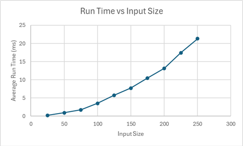
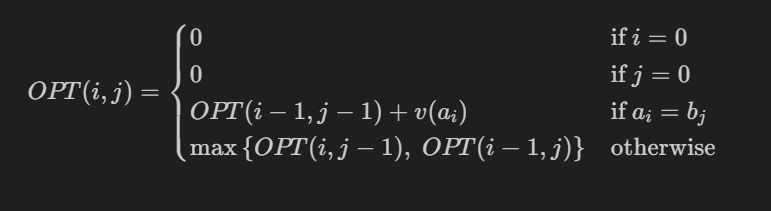

# Programming-Assignment-3

### Kevin Jin, 24470226
### Keerat Kohli, 41823869

To run our code, run from main.py in the src folder.

Upon running, user will be prompted to run either "custom" or "standard" tests. Please type the desired mode exactly as it appears to select. 

Standard tests are ten nontrivial input files that have been used to answer Question 1 stored in the tests folder. These tests contain strings with lengths of increasing multiples of 25. The size of the alphabet in all tests is 10. The result will be returned in the corresponding output files in the tests folder.

To run user-defined tests, select custom mode and create an input.in file in the data folder with the correct format. The result will be returned in an output.out file in the data folder. The results will also be printed. An example input.in and output.out file has already been provided.

Both modes assume that the file input is in the following format:

K

x_1 v_1

x_2 v_2

...

x_K v_K

A

B

Where K is the number of characters in the alphabet. The next K lines contain character-value pairs for the scores of each character. A is the first string and B is the second string.

The output gives the maximum value of a common subsequence along with the subsequence that generated that score.

## Question 1

The graph for the runtime of tests of varying input sizes is displayed below.

We can see from the graph that there is a clear quadratic trend, where an increase in input size by 25 causes the runtime to be much slower when the input size is already 200 as opposed to when it is only 25. Since in our test cases the lengths of A and B are the same, we will see that the runtime being quadratic O(n^2) aligns with our theoretical results.

### Question 2

We start by stating an assumption we made: values of characters are nonnegative.

Before we define the recurrence relation, denote $OPT(i, j) = \text{maximum value of common subsequence between } A = a_1a_2...a_i \text{ and } B = b_1b_2...b_j$. Let the length of A be m and the length of B be n. Using this defintion of OPT, we then first consider the base cases. If $i = 0$ or $j = 0$, then we are comparing a substring to an empty string. Since this can never have a common subsequence, we set these values to 0. In other words, $OPT(0, j) = 0$ $\forall j$ and $OPT(i, 0) = 0$ $\forall i$.

Then, in any other scenario, we have a few cases. If $a_i = b_j$, then we can add the character to the common subsequence. Since we assumed values are nonnegative, we can always take the character and end up with a value greater than or equal to any previous value. So in this case we add the value of character $a_i$ (or $b_j$ since they are the same character) to the max value of the common subsequence between $a_1...a_{i-1}$ and $b_1...b_{j-1}$. Thus in this case we get a value of $OPT(i - 1, j - 1) + v(a_i)$. 

Now, if $a_i \ne b_j$, then we cannot extend the common subsequence at this point including both $a_i$ and $b_j$. The final common subsequence will use at most one of these characters. If $a_i$ is not in the final common subsequence, then the max value common subsequence is between $a_1...a_{i-1}$ and $b_1...b_j$. If $b_j$ is not in the final common subsequence, then the max value is between $a_1...a_i$ and $b_1...b_{j-1}$. In total we have 2 cases and since we want the maximum value in the end, we take the max of these two options, giving us $max\{OPT(i, j - 1), OPT(i - 1, j)\}$.

Thus, in total our recurrence relation is 

### Question 3

**Algorithm: HVLCS(A, B, values)**

- Let `m = len(A)` and `n = len(B)`
- Initialize 2d array `M[0...m][0...n]` 
- for `j = 0` to `n`:
    - `M[0, j] = 0`
- for `i = 1` to `m`:
    - `M[i, 0] = 0`

- for `i = 1` to `m`:
    - for `j = 1` to `n`:
        - if `a_i == b_j`:
            - `M[i, j] = M[i - 1, j - 1] + values(a_i)`
        - else:
            - `M[i, j] = max{M[i - 1, j], M[i, j - 1]}`

- Return `M[m, n]`

To determine the runtime of the algorithm, we first note that our base cases are each O(n) and O(m) respectively (since we just loop through the first row/column and put 0's). Then, for the double for loop, we note that in each iteration we add a new entry to our data structure M that stores results from previous subproblems. After $mn$ iterations, the data structure is filled and we have our final result in $M[m, n]$. Hence, this nested for loop has running time $O(mn)$ where $m$ is the length of string A and $n$ is the length of string B. Thus overall, our running time is O(n) + O(m) + O(mn) = $O(mn)$.
